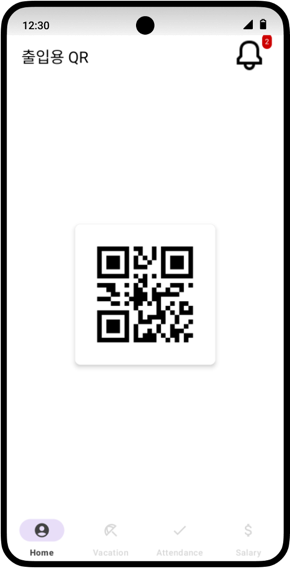
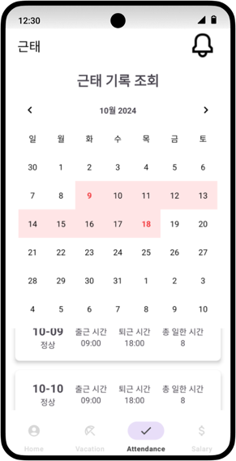

# QR을 통한 인사관리시스템 출퇴근 관리

## 소개

- 캡스톤 디자인으로 개발한 [ERP 인사관리시스템](https://github.com/Junseo0324/Capstone_ERP)과 연동되는 QR 기반 출퇴근 관리 애플리케이션입니다.
- ERP 시스템에서 발급된 직원용 QR 코드를 인식하여 **출근·퇴근을 자동으로 기록**하고, 기존 ERP 인사 데이터와 즉시 반영됩니다.
- ERP 시스템 내의 **급여·근태·휴가 관리 기능과 직접 연결**되어, 현장에서 즉시 활용 가능한 인사관리 솔루션을 제공합니다.

## 팀 소개

| 이름     | 역할       | GitHub 프로필 |
|----------|------------|----------------|
| 허준서   | 팀장       | [Junseo0324](https://github.com/Junseo0324) |
| 임채률   | 팀원     | [chaechae0817](https://github.com/chaechae0817) |

 

## 주요 기능
1. QR을 통한 출퇴근 관리
2. 직원 급여 조회
3. 휴가 현황 조회
4. 근태 현황 조회
5. 알림을 통한 현황 조회

 

## 아키텍처

> 본 프로젝트는 **MVVM 패턴 기반의 클라이언트 구조**로 만들었습니다.

## 기술 스택

| 분류        | 사용 기술 / 도구                                   |
| --------- | -------------------------------------------- |
| **개발 언어** | Kotlin                         |
| **프레임워크** | Android(MVVM)                    |
| **상태 관리** | LiveData, ViewModel, DataBinding                   |
| **DI**    | Hilt                                         |
| **스토리지**  | SharedPreferences                |
| **QR**   | ZXing         |
| **협업 도구** | GitHub,  Notion                        |

---

## 서비스 UI
 
